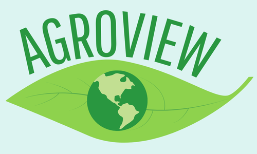
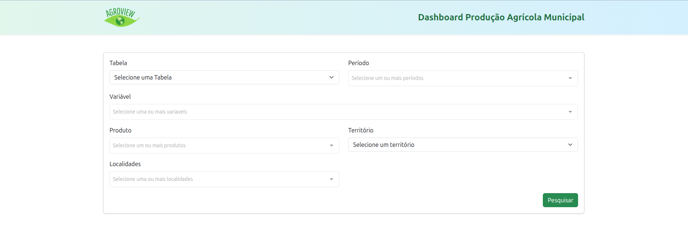
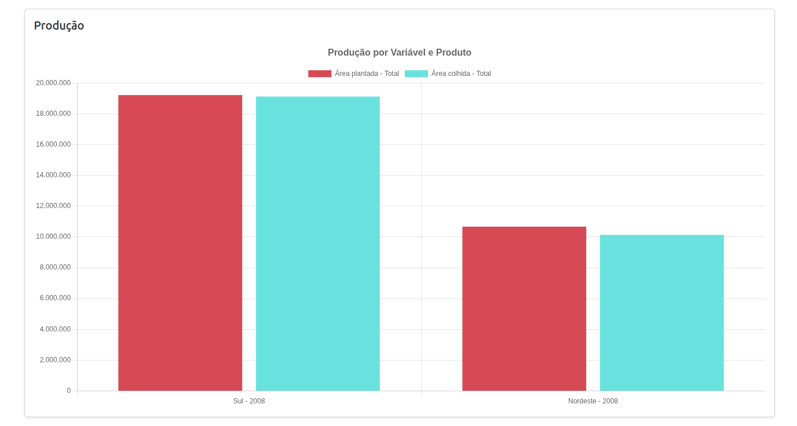
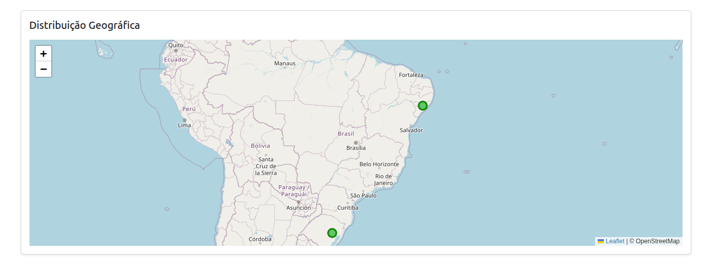

# AgroView - Dashboard de Produção Agrícola Municipal

<p align="center">
  
</p>

---

## Sobre o Projeto

O **AgroView** é uma aplicação web single-page desenvolvida em Vue.js que permite visualizar dados de produção agrícola municipal através de filtros dinâmicos, gráficos interativos e mapas geográficos.

Ao selecionar os filtros, o usuário realiza uma consulta que retorna os dados da API backend. Com esses dados, a aplicação gera automaticamente um gráfico de produção e uma visualização geográfica da distribuição da produção.

---

## Funcionalidades

- Filtros customizáveis para tabela, período, variável, produto, território e localidades.
- Gráfico dinâmico que exibe dados de produção como plantação, produção e colheita.
- Mapa interativo que mostra a distribuição geográfica dos resultados.
- Mensagens de erro claras para casos sem dados ou erros de API.
- Integração com API backend para busca dos dados em tempo real.

---

## Como Funciona o Sistema

1. O usuário seleciona uma **Tabela** (ex: Lavouras temporárias).
2. O sistema carrega os **Períodos**, **Variáveis**, **Produtos** e **Níveis/Territórios** associados à tabela.
3. O usuário escolhe um ou mais períodos, variáveis, produtos e um território.
4. Com base na seleção, o sistema carrega as localidades do território escolhido.
5. Ao clicar em **Pesquisar**, a aplicação faz uma requisição para a API backend passando os filtros selecionados.
6. A API retorna os dados correspondentes, que são usados para gerar:
   - Um gráfico interativo mostrando a produção.
   - Um mapa com marcadores nas localidades, ilustrando a produção geográfica.
7. Caso não haja dados ou ocorra algum erro, o usuário recebe uma mensagem clara na interface.

---

## Imagens da Aplicação

### Tela de Filtros



---

### Gráfico de Produção



---

### Mapa de Distribuição



---

## Tecnologias Utilizadas

- Vue.js 3
- Axios para requisições HTTP
- Chart.js para gráficos
- Leaflet para mapas
- Bootstrap para estilização

---

## Como Rodar o Projeto

### Pré-requisitos

- Node.js (versão recomendada: 18+)
- npm ou yarn

### Passos para rodar localmente

1. Clone o repositório:
   ```bash
   git clone https://github.com/Luan-Kleber/agroview_web.git 
   ```
2. Entre na pasta do projeto:

   ```bash
   cd agroview_web

   ```

3. Instale as dependências:

   ```bash
   npm install
   # ou
   yarn

   ```

4. Rode a aplicação em modo de desenvolvimento:

   ```bash
   npm run dev
   # ou
   yarn dev

   ```

5. Acesse no navegador:
   ```bash
   http://localhost:3000
   (ou a porta que o Vite informar no terminal)
   ```

---

### Configuração do Backend

Nota: Este projeto depende de uma API backend rodando na porta 8000. Configure o arquivo .env com a URL da API se necessário (exemplo: VITE_API_URL=http://localhost:8000).

## 👨‍💻 Autor

- Nome: Luan Amaral
- LinkedIn: [linkedin.com/in/luan-kleber-amaral](https://www.linkedin.com/in/luan-kleber-amaral-0b2abb187/)
- Email: luanamaral.6540@hotmail.com
